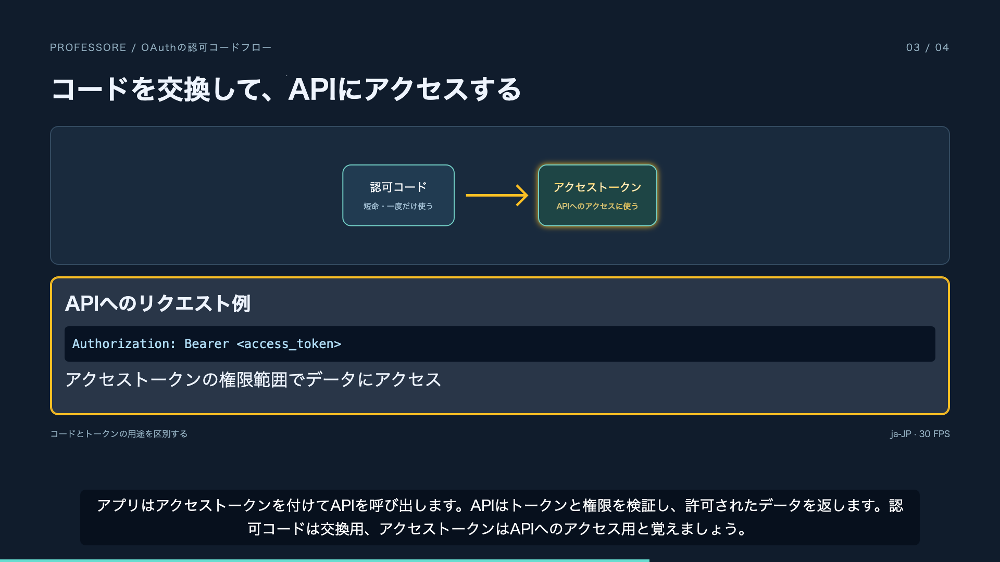

# Professore

会話で組み立てた原稿を、図・日本語ナレーション・字幕付きの解説MP4にするローカル制作ツールです。原稿をホストAIが作り、Professoreが検証・音声生成・同期・描画を担当します。アプリ内のLLM契約やAPIキーは不要です。

[実音声付きサンプルMP4（2分13秒）](examples/output/video.mp4) · [検証結果](docs/verification.md)



## 起動（macOS）

macOS 14以降、mise、FFmpegが必要です。Bun 1.3.14を `mise.toml` で固定しています。macOSのシステム設定で日本語の声 **Kyoko** をダウンロードしてください。`say -v '?'` で確認できます。

```sh
brew install mise ffmpeg
mise trust
mise install
mise run setup
mise run start
```

`mise run setup` はロック済み依存・Chromiumのインストールとビルドを行います。シェルでmiseを有効化していない場合、以下の `bun` コマンドには `mise exec --` を前置してください（例：`mise exec -- bun run cli list`）。

[制作スタジオ](http://127.0.0.1:4318) を開き、`examples/oauth.json` を取り込みます。「構造検証」→「保存」→「MP4を生成」で制作できます。「生成・成果物」から動画や静止画を確認・保存します。

サービスはフォアグラウンドで稼働し、Ctrl+Cで終了します。ブラウザやMCPクライアントを閉じてもサービスが動いていればジョブは継続します。サービス自体の停止で実行中ジョブは中断／キャンセルになります。再起動後に「再実行」できます。

## CLIでサンプルを生成

サービスを別のターミナルで起動した状態で実行します。

```sh
bun run cli validate examples/oauth.json
bun run cli import examples/oauth.json
bun run cli review oauth examples/review.json
bun run cli render oauth
# 返された id を以下の JOB_ID に指定
bun run cli wait JOB_ID
bun run cli download JOB_ID video.mp4 ./oauth.mp4
```

`examples/review.json` は同梱サンプル専用です。異なる原稿に流用せず、AIまたは人が内容を確認してレビューを記録してください。構造検証・意味レビュー・MP4出力成功は別々の状態です。

- `list` / `get ID [REVISION]` / `export ID FILE`：原稿の取得・書き出し
- `import FILE EXPECTED_REVISION`：原稿全体を更新。新規は0、更新は取得した番号
- `scene ID REVISION SCENE_ID SCENE_JSON`：シーン単位の置換（IDを維持）
- `audio ID [REVISION]`：実音声とタイムラインを生成
- `preview ID [REVISION]`：音声・シーン静止画・beat状態画像を生成
- `render ID [REVISION]`：H.264/AAC MP4を生成
- `jobs` / `status JOB_ID` / `cancel JOB_ID` / `retry JOB_ID`：ジョブ操作
- `asset PROJECT_JSON ASSET_ID FILE`：SVG/PNG/JPEGをJSONへ明示的に取り込み

JSON取り込みは埋め込まれたアセットだけを読み、原稿中のファイルパスやURLを読み取りません。参考資料のURLは出典メタデータです。自動取得しません。

## 原稿・差分再生成

正本は [JSON Schema](schema/project.schema.json) と [サンプル](examples/oauth.json)。Markdownはシーン本文や要素の中に書きます。MarkdownのHTML・画像・リンクは除去し、見出し・本文・箇条書き・コードなどを表示します。

- `scenes[].elements[]`：安定ID、`markdown` / `mermaid` / `asset`、初期表示状態
- `beats[]`：安定ID、表示用 `narration`、任意の `speech`、前後の間（秒）
- `events[]`：`target`, `action`（show/hide/highlight/unhighlight）, `at`（start/end）、`fade`（表示・非表示の0〜0.5秒）
- `target: "exchangeDiagram#code"`：SVG内の安定IDを指定。Mermaidは図全体を対象にする
- `settings.pronunciations`：表示を変えずに発音を置換。`speech` を指定したbeatでは上書き文を優先
- `settings.subtitles`：字幕焼き込みのON/OFF。完成済みMP4の字幕はプレーヤーから切り替えられないため、設定変更後に再出力

要素の領域は非表示中も確保します。図の差し替えで配置が動くのを避けるには、同じSVG viewBox・同じノード集合で図を用意してください。現在のレイアウトは全体、図＋補足、比較の3種類です。SVGは安全な図形・文字・内部参照のみを許可します。スクリプト、HTML埋め込み、外部リソース、任意CSSは拒否します。

音声キャッシュは読み上げ文・音声設定・辞書・プロバイダーバージョン・OS版をキーにします。見た目だけの変更は音声を再利用し、動画を再描画します。変更したbeatだけ音声を作り直し、後続タイムラインを再計算します。最終エンコードは全体を実行します。

## Codex / Claude Codeへ追加（ユーザースコープ）

MCPはstdio、Skillは同梱の [制作手順](skills/professore/SKILL.md) です。両方を登録すると、別のプロジェクトからもProfessoreを使えます。MCPは独立サービスへ生成を依頼するため、先にリポジトリで `mise run start` を別ターミナルで起動してください。MCP接続を閉じてもサービスのジョブは継続します。

以下はこのリポジトリのルートで実行します。`mise trust` / `mise install` / `mise run setup` は済ませておいてください。

```sh
PROFESSORE_DIR="$(pwd -P)"
PROFESSORE_MISE="$(command -v mise)"
```

### Codex

`codex mcp add` はユーザー設定（通常 `~/.codex/config.toml`、`CODEX_HOME` を設定している場合はその配下）へ登録します。`--scope` オプションは不要です。Skillはユーザー用の `~/.agents/skills` にリンクします。

```sh
codex mcp add professore -- "$PROFESSORE_MISE" \
  -C "$PROFESSORE_DIR" exec -- bun "$PROFESSORE_DIR/src/mcp.ts"

mkdir -p "$HOME/.agents/skills"
ln -s "$PROFESSORE_DIR/skills/professore" "$HOME/.agents/skills/"

codex mcp get professore
```

次のターン／新しいセッションで `$professore` を指定して制作を依頼できます。MCPが現在のセッションに表示されない場合はCodexを再起動してください。CLIとデスクトップアプリはユーザーのMCP設定を共有します。[公式MCP設定](https://learn.chatgpt.com/docs/extend/mcp?surface=cli)、[Skillのユーザースコープとリンク](https://learn.chatgpt.com/docs/build-skills)

### Claude Code

MCPは `--scope user` を指定します。指定しない場合の既定はlocalなので注意してください。Skillは `~/.claude/skills` にリンクします。

```sh
claude mcp add --scope user --transport stdio professore -- \
  "$PROFESSORE_MISE" -C "$PROFESSORE_DIR" exec -- bun "$PROFESSORE_DIR/src/mcp.ts"

mkdir -p "$HOME/.claude/skills"
ln -s "$PROFESSORE_DIR/skills/professore" "$HOME/.claude/skills/"

claude mcp get professore
```

Claude Codeの `/mcp` で接続を確認し、`/professore` でSkillを呼び出します。必要に応じて新しいセッションを開いてください。[公式MCPスコープ](https://code.claude.com/docs/en/mcp)、[個人用Skill](https://code.claude.com/docs/en/skills)

### 更新・接続確認

上記は初回登録用です。同名のMCPやSkillが既にある場合は先に内容を確認してください。Skillのリンク作成は既存の同名エントリーを上書きしません。リンク方式なので `git pull` 後のSkill更新にも追随します。リポジトリを移動・削除するとMCPの起動パスとSkillのリンク先が無効になるため、再登録してください。

独立サービスの生存確認は `curl http://127.0.0.1:4318/api/health`、CLIの確認は `mise exec -- bun run cli list`。ポートを変える場合は、MCP追加時にもCodexなら `--env PROFESSORE_PORT=4320`、Claude Codeなら `--env PROFESSORE_PORT=4320` を `--` より前に指定します。

確認したCLIは **Codex 0.146.0 / Claude Code 2.1.265**。Codexのユーザー登録とMCPプロトコル接続を検証しています。Claude Codeの例はインストール済みCLIの `mcp add --help` と公式ドキュメントで確認しています。

ツール：`list_projects`, `get_project`, `save_project`, `update_scene`, `validate_project`, `record_review`, `start_job`, `get_job`, `list_jobs`, `cancel_job`, `retry_job`。`start_job` はすぐにジョブIDを返します。成果物は `http://127.0.0.1:4318/api/jobs/JOB_ID/artifacts/FILE` から取得できます。アプリ内に追加のLLM契約やAPIキーは不要です。

## 保存先・設定

既定はサービスを起動したディレクトリの `.professore/` です。UIにも絶対パスを表示します。

```sh
PROFESSORE_HOME=/absolute/path/to/data PROFESSORE_PORT=4318 bun run start
```

`PROFESSORE_PORT` を変えた場合はCLI・MCPにも同じ環境変数を渡します。データディレクトリは1サービスが所有し、多重起動を拒否します。

```text
.professore/
  projects/ID/current.json        現在の原稿
  projects/ID/revisions/N.json    不変の原稿履歴
  projects/ID/reviews/N.json      意味レビュー
  cache/                         beat音声キャッシュ
  jobs/JOB_ID.json                状態・エラー
  outputs/JOB_ID/                 成功時だけ確定
    project.json                 生成に使った原稿・埋め込みアセット
    generated.json               実測音声長・タイムライン・キャッシュキー
    audio-BEAT_ID.wav             beatごとの音声
    narration.wav                間を含む全音声
    video.mp4                    最終動画（renderのみ）
    scene-SCENE_ID.png            シーン静止画（preview/render）
    frames.json / frame-*.png     イベントごとの画面
    report.json / ffprobe.json    検証結果
```

原稿を更新しても生成中ジョブのリビジョンは変わりません。成功後に作業ディレクトリをrenameして確定します。途中ファイルはダウンロードできません。再試行は元リビジョンから新ジョブを作ります。キャッシュを消しても正本や完成動画は失われません。

## 検証・制約

```sh
bun test
bun run check
bun run build
bun run e2e:ui  # ローカルUIの編集・再生・保存
bun run e2e:lifecycle  # 一時サービスの再起動復旧
bun run e2e  # 起動中サービス・macOSの日本語音声・Chromium・FFmpegが必要
```

[設計・採用理由](docs/design.md)、[検証結果と制約](docs/verification.md) を参照してください。外部URLに依存せずレンダリングし、ローカルサービスは127.0.0.1でのみ待ち受け、Host/Originを検証します。

音声が空の場合は、声のダウンロードとmacOS音声サービスへのアクセスを確認してください。サンドボックス内では `say` が成功コードでも空音声を返す場合があります。本アプリは空音声を失敗として扱い、ダミー音声へ切り替えません。TTSはタイムアウトと1回の再試行を行います。

フォントはmacOSの「Hiragino Sans」または「Hiragino Kaku Gothic ProN」です。別OSの本番TTS、単語単位同期、自由なコード実行、ネイティブ包装、クラウド配信は未対応です。画面プレビューは配置確認用で、音声生成後のMP4が確定タイムラインによる再生結果です。
